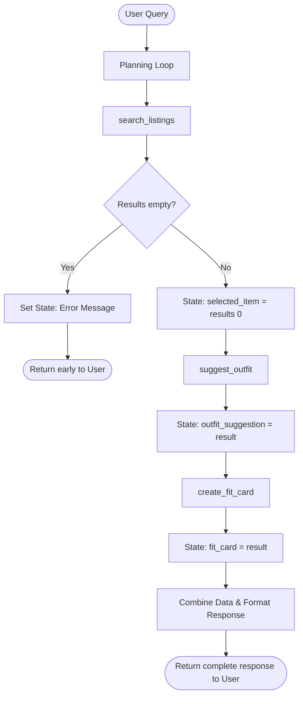

# FitFindr — planning.md

> Complete this document before writing any implementation code.
> Your spec and agent diagram are what you'll use to direct AI tools (Claude, Copilot, etc.) to generate your implementation — the more specific they are, the more useful the generated code will be.
> Your planning.md will be reviewed as part of your submission.
> Update it before starting any stretch features.

---

## Tools

List every tool your agent will use. For each tool, fill in all four fields.
You must have at least 3 tools. The three required tools are listed — add any additional tools below them.

### Tool 1: search_listings

**What it does:**
<!-- Describe what this tool does in 1–2 sentences -->
Searches the mock dataset of secondhand clothing listings based on natural language descriptors, filtering by size and a maximum price.

**Input parameters:**
<!-- List each parameter, its type, and what it represents -->
- `description` (str): The keyword or style description of the item (e.g., "vintage graphic tee", "baggy jeans").
- `size` (str): The specific size requested by the user, if applicable (e.g., "M", "W30", "US 8"). Can be None.
- `max_price` (float): The maximum price the user is willing to pay. Can be None.

**What it returns:**
<!-- Describe the return value — what fields does a result contain? -->
A list of dictionary objects representing the matching listings. Each dictionary contains: id (str), title (str), description (str), category (str), style_tags (list[str]), size (str), condition (str), price (float), colors (list[str]), brand (str or None), and platform (str).

**What happens if it fails or returns nothing:**
<!-- What should the agent do if no listings match? -->
If no results match (or if the tool throws an error), the tool returns an empty list []. The agent must catch this, halt the planning loop (do not call subsequent tools), and return a friendly message to the user specifying which parameter caused the issue (e.g., "I couldn't find any vintage graphic tees under $15. Would you like me to check up to $30?")

---

### Tool 2: suggest_outfit

**What it does:**
<!-- Describe what this tool does in 1–2 sentences -->
Evaluates a newly found item against the user's existing wardrobe schema and generates a stylish, cohesive outfit recommendation incorporating both.

**Input parameters:**
<!-- List each parameter, its type, and what it represents -->
- `new_item` (dict): The complete dictionary object of the single selected item returned from search_listings.
- `wardrobe` (dict): The user's current wardrobe schema (containing the items list of dictionaries with name, category, colors, style_tags).

**What it returns:**
<!-- Describe the return value -->
A string containing a natural language outfit suggestion (e.g., "Pair this faded band tee with your dark wash baggy jeans and chunky white sneakers. Wear the tee loose for a 90s streetwear vibe.").

**What happens if it fails or returns nothing:**
<!-- What should the agent do if the wardrobe is empty or no outfit can be suggested? -->
If the wardrobe is completely empty or no logical pairing can be made, the tool returns a generic styling suggestion based entirely on universal fashion staples (e.g., "Since your wardrobe is currently empty, I recommend pairing this with some classic blue jeans and white sneakers.").

---

### Tool 3: create_fit_card

**What it does:**
<!-- Describe what this tool does in 1–2 sentences -->
Takes the technical outfit suggestion and the details of the newly found item to draft a punchy, highly shareable social media caption (a "fit card").

**Input parameters:**
<!-- List each parameter, its type, and what it represents -->
- `outfit` (...): The styling suggestion generated by suggest_outfit.

**What it returns:**
<!-- Describe the return value -->
A short, stylized string ready for social media (e.g., "thrifted this faded band tee off depop for $19 and it’s about to live rent-free with my baggy jeans 🖤 full look in my stories").

**What happens if it fails or returns nothing:**
<!-- What should the agent do if the outfit data is incomplete? -->
If the outfit data is missing, the tool defaults to generating a hype caption focused solely on the item's details (price, brand, platform), ignoring the rest of the outfit.

---

### Additional Tools (if any)

<!-- Copy the block above for any tools beyond the required three -->

---

## Planning Loop

**How does your agent decide which tool to call next?**
<!-- Describe the logic your planning loop uses. What does it look at? What conditions change its behavior? How does it know when it's done? -->
The planning loop operates sequentially but relies on strict conditional checks at each step:

Extract & Search: The agent parses the user's prompt for description, size, and max_price, then calls search_listings().

Evaluate Search Results (Branch A): - If results is empty: Set an error message in the session state ("No listings found matching your criteria. Try adjusting the price or size.") and immediately return to the user, terminating the loop.

If results has items: Assign session["selected_item"] = results[0] and proceed to the next step.

Style the Item: Call suggest_outfit(session["selected_item"], current_wardrobe). Save the return value to session["outfit_suggestion"].

Generate Fit Card: Call create_fit_card(session["outfit_suggestion"], session["selected_item"]). Save the return value to session["fit_card"].

Final Output: Combine the search result details, the outfit suggestion, and the fit card into a single, cohesive markdown response for the user.

---

## State Management

**How does information from one tool get passed to the next?**
<!-- Describe how your agent stores and accesses state within a session. What data is tracked? How is it passed between tool calls? -->
State is managed via a shared session_state dictionary passed through the loop during a single interaction.

When search_listings returns data, the top item is saved to session_state["selected_item"].

suggest_outfit reads session_state["selected_item"] and outputs a string, which is then written to session_state["outfit_suggestion"].

create_fit_card reads both session_state["outfit_suggestion"] and session_state["selected_item"] to generate the final string, saved to session_state["fit_card"].
This ensures tools do not need to re-parse the original user prompt; they rely strictly on the structured data passed down the chain.

---

## Error Handling

For each tool, describe the specific failure mode you're handling and what the agent does in response.

| Tool | Failure mode | Agent response |
|------|-------------|----------------|
| search_listings | No results match the query | "I searched the platforms but couldn't find a match for that specific item in that size/price range. Do you want to remove the size filter or raise your budget?" |
| suggest_outfit | Wardrobe is empty | "I see your wardrobe profile is empty right now! To style this, I'd recommend sticking to basics—pair it with standard blue denim and your favorite everyday sneakers." |
| create_fit_card | Outfit input is missing or incomplete | "Just copped this [Item Name] for $[Price] on [Platform]! Huge steal." (Agent drops the outfit context and focuses solely on hyping the individual piece)." |

---

## Architecture

<!-- Draw a diagram of your agent showing how the components connect:
     User input → Planning Loop → Tools (search_listings, suggest_outfit, create_fit_card)
                                                                          ↕
                                                                   State / Session
     Show what triggers each tool, how state flows between them, and where error paths branch off.
     ASCII art, a Mermaid diagram (https://mermaid.js.org/syntax/flowchart.html), or an embedded
     sketch are all fine. You'll share this diagram with an AI tool when asking it to implement
     the planning loop and each individual tool. -->

---

## AI Tool Plan

<!-- For each part of the implementation below, describe:
     - Which AI tool you plan to use (Claude, Copilot, ChatGPT, etc.)
     - What you'll give it as input (which sections of this planning.md, your agent diagram)
     - What you expect it to produce
     - How you'll verify the output matches your spec before moving on

     "I'll use AI to help me code" is not a plan.
     "I'll give Claude my Tool 1 spec (inputs, return value, failure mode) and ask it to implement
     search_listings() using load_listings() from the data loader — then test it against 3 queries
     before trusting it" is a plan. -->

**Milestone 3 — Individual tool implementations:**
Tool: Claude Code

Input: I will give Claude the Tool 1, Tool 2, and Tool 3 blocks from this planning.md document, alongside the data_loader.py and wardrobe_schema.json files.

Expected Output: Three separate Python functions defining the tools, properly annotated with docstrings so the LLM can understand them.

Verification: Before moving on, I will ask Claude to write a simple test_tools.py script that manually passes mock data to each function (e.g., passing "vintage graphic tee" and a max price of 30 to search_listings). I will run the script to verify the return types match the spec and handle empty inputs correctly.

**Milestone 4 — Planning loop and state management:**
Tool: Claude Code

Input: I will give Claude the Planning Loop, State Management, and Architecture (Mermaid diagram) sections from this document, plus the Groq LLM setup from Project 1.

Expected Output: A main.py orchestrator that initializes the Groq client, defines the session_state dictionary, and implements the loop logic that parses the LLM's tool calls and routes data sequentially.

Verification: I will test the loop by passing an impossible query (e.g., "Find me a Gucci jacket for $2") to verify the early-return error path triggers, followed by the "vintage band tee under $30" query to verify state flows correctly from search -> style -> fit card.

---

## A Complete Interaction (Step by Step)

Write out what a full user interaction looks like from start to finish — tool call by tool call. Use a specific example query.

**Example user query:** "I'm looking for a vintage graphic tee under $30. I mostly wear baggy jeans and chunky sneakers. What's out there and how would I style it?"

**Step 1:**
<!-- What does the agent do first? Which tool is called? With what input? -->
The agent extracts the search parameters from the user's prompt and calls the first tool: search_listings(description="vintage graphic tee", size=None, max_price=30.0). It searches the mock database and finds a match: Item lst_033 ("Vintage Band Tee — Faded Grey", $19.00, Depop).
(If this step failed, the agent would tell the user no tees were found under that price and ask if they want to raise the budget, skipping Steps 2 and 3).

**Step 2:**
<!-- What happens next? What was returned from step 1? What tool is called now? -->
Because an item was successfully found, the agent moves to styling. It calls suggest_outfit(new_item=lst_033, wardrobe=example_wardrobe). The tool reviews the wardrobe schema and identifies item w_001 (Baggy straight-leg jeans) and w_007 (Chunky white sneakers). It returns a styling suggestion: "Pair this faded grey band tee with your dark wash baggy jeans and chunky white sneakers. Let the tee sit loose over the jeans for a relaxed 90s streetwear vibe."

**Step 3:**
<!-- Continue until the full interaction is complete -->
The agent takes the item and the suggested outfit, calling create_fit_card(outfit="Relaxed 90s streetwear with baggy jeans and chunky sneakers", new_item=lst_033). The tool generates a punchy, social-media-ready string.

**Final output to user:**
<!-- What does the user actually see at the end? -->
The user sees a cohesive response:
"I found a great Vintage Band Tee in faded grey for $19.00 on Depop. Since you wear baggy jeans and chunky sneakers, this fits perfectly into your rotation. You can wear it loose over your dark wash jeans with your white sneakers for a classic 90s streetwear look.
Fit Card: copped this faded grey band tee for $19 and it’s about to live rent-free with my baggy jeans and chunky sneakers 🛹💿"
